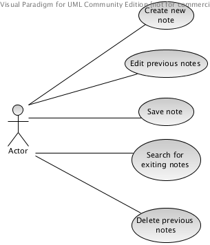

Daftar
======

A Simple note-taking application.

* Mailing list: daftar-dev@googlegroups.com
* Daftar page on Github: http://daftar-dev.github.io/daftar
* clone Daftar repo: `git clone git@github.com:daftar-dev/daftar.git`

## Use Case

### UC-1: Create new note

| Tables        | Are           | Cool  |
|:-----:|:-----|
| ID | UC-1 |
| Title | Create new note |
| Description |  |
| Primary Actor |  |
| Preconditions |  |
| Postconditions |  |
| Main Success Scenario |
1. Student selects “Register New Courses” from the menu.
2. System displays list of courses available for registering.
3. Student selects one or more courses he wants to register for.
4. Student clicks “Submit” button. |
